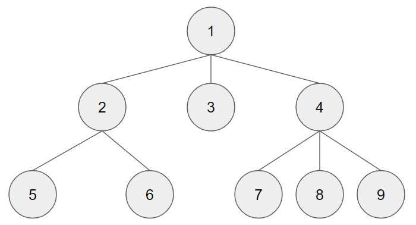
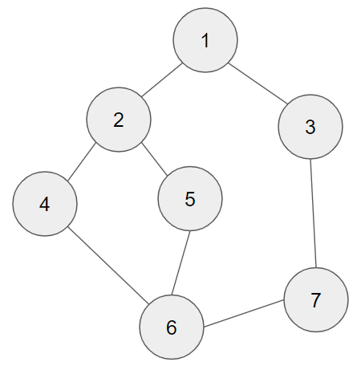

# BFS Algorithm

너비우선 탐색, Breadth First Search, BFS




```python
def BFS(G, v):
    """G: Graph, v: starting point on G"""
    visited = [0] * 9  # 정점의 개수
    queue = []  # create queue 
    queue.append(v)  # insert starting point to queue
    while queue:  # while queue is not empty
        t = queue.pop(0)  # return queue's first element
        if not visited[t]:  # if t is not visited
            visited[t] = True  # check visited
            visit(t)
        for i in G[t]:  # for all node connected to t
            if not visited[i]:  # if near node is not visited
                queue.append(i)  # insert to queue

G = [
    [1, 2, 3],
    [4, 5],
    [0],
    [0, 6, 7, 8],
    [1],
    [1],
    [3],
    [3],
    [3],
]

BFS(G, 0)
```




```python
def BFS(G, v):
    """G: Graph, v: starting point on G"""
    visited = [0] * len(G)  # 정점의 개수
    queue = []  # create queue 
    queue.append(v)  # insert starting point to queue
    while queue:  # while queue is not empty
        t = queue.pop(0)  # return queue's first element
        if not visited[t-1]:  # if t is not visited
            visited[t-1] = True  # check visited
            print(f"visit to {t}")
        for i in G[t-1]:  # for all node connected to t
            if not visited[i-1]:  # if near node is not visited
                queue.append(i)  # insert to queue

G = [
    [2, 3],
    [4, 5],
    [1, 7],
    [2, 6],
    [2, 6],
    [4, 5, 7],
    [3, 6],
]
BFS(G, 1)
```

