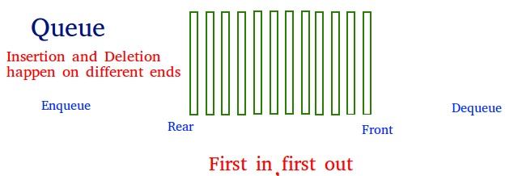

# Queue

## 특징

- 삽입과 삭제의 위치가 제한적인 자료구조
- FIFO (First In Fiest Out)



## 선형 큐의 연산

### 공백 큐 생성

```python
n = 1000
front = rear = -1
Q = [0 for _ in range(n)]
```

### 원소 삽입

```python
def enqueue(item):
    global rear
    if is_full():
        print("Queue is Full")
    else:
        rear += 1
        Q[rear] = item
```

### 삭제

```python
def dequeue():
    if is_empty():
       Queue_Empty();
    else:
        Q[front] = 0
        front += 1
        return Q[front]
```

### 상태 검사 (공백, 포화)

```python
def is_empty():
    return front == rear

def is_full():
    return rear == len(Q) - 1
```

### 검색

가장 앞의 원소를 반환

```python
def qpeek():
    if is_empty():
        print("Queue is empty")
    else:
        return Q[front+1]
```

### Class로 구현

```python
class Queue:
    def __init__(self, n=1000):
        self.front = self.rear = -1
        self.Q = [0 for _ in range(n)]
    
    def enqueue(self, x):
        self.rear += 1
        self.Q[self.rear] = x
    
    def dequeue(self):
        self.front += 1
        val = self.Q[self.front]
        self.Q[self.front] = 0
        return val
    
    def qpeak(self):
        if self.is_empty():
            print("Queue is empty")
        else:
            return self.Q[self.front+1]
    
    def is_empty(self):
        return self.front == self.rear
    
    def is_full(self):
        return self.rear == len(self.Q) - 1
    
    def print(self):
        print([x for x in self.Q if x > 0], f"\tf: {self.front}, r:{self.rear}")

Q = Queue(3)
Q.enqueue(1)
Q.enqueue(2)
Q.enqueue(3)
print(Q.dequeue())
print(Q.dequeue())
print(Q.dequeue())
```


## 선형 큐의 문제점

### 잘못된 포화상태 인식

리스트의 앞부분이 비어있어도 rear가 Q의 길이에 도달하는 경우 포화상태로 인식한다.

해결 방안) 원형 큐로 구현


## 원형 큐 (Circular Queue)

### 상태 검사 (공백, 포화)

```python
def is_empty():
    return front == rear

def is_full():
    return (rear + 1) % len(Q) == front
```

### class로 구현

```python
class CircularQueue:
    def __init__(self, n=1000):
        self.front, self.rear = 0, 0
        self.Q = [0 for _ in range(n)]
    
    def enqueue(s, x):
        if s.is_full():
            print("Circular Queue is Already Full")
        else:
            s.rear = (s.rear + 1) % len(s.Q)
            s.Q[s.rear] = x
    
    def dequeue(s):
        if s.is_empty():
            print("Circular Queue is Empty")
        else:
            s.front = (s.front + 1) % len(s.Q)
            val = s.Q[s.front]
            s.Q[s.front] = 0
            return s.Q[s.front]
    
    def qpeak(self):
        if s.is_empty():
            print("Circular Queue is Empty")
        else:
            return s.Q[s.front]
    
    def is_empty(self):
        return self.front == self.rear
    
    def is_full(self):
        return self.front == (self.rear + 1) % len(self.Q)
    
    def print(self):
        print(self.Q, f"\tf: {self.front}, r:{self.rear}")

cQ = CircularQueue(7)
cQ.print()
for i in range(1, 7):
    cQ.enqueue(i)
    cQ.print()
for i in range(5):
    cQ.dequeue()
    cQ.print()
for i in range(1, 7):
    cQ.enqueue(i)
    cQ.print()
```

```
[0, 0, 0, 0, 0, 0, 0] 	f: 0, r:0
[0, 1, 0, 0, 0, 0, 0] 	f: 0, r:1
[0, 1, 2, 0, 0, 0, 0] 	f: 0, r:2
[0, 1, 2, 3, 0, 0, 0] 	f: 0, r:3
[0, 1, 2, 3, 4, 0, 0] 	f: 0, r:4
[0, 1, 2, 3, 4, 5, 0] 	f: 0, r:5
[0, 1, 2, 3, 4, 5, 6] 	f: 0, r:6
[0, 0, 2, 3, 4, 5, 6] 	f: 1, r:6
[0, 0, 0, 3, 4, 5, 6] 	f: 2, r:6
[0, 0, 0, 0, 4, 5, 6] 	f: 3, r:6
[0, 0, 0, 0, 0, 5, 6] 	f: 4, r:6
[0, 0, 0, 0, 0, 0, 6] 	f: 5, r:6
[1, 0, 0, 0, 0, 0, 6] 	f: 5, r:0
[1, 2, 0, 0, 0, 0, 6] 	f: 5, r:1
[1, 2, 3, 0, 0, 0, 6] 	f: 5, r:2
[1, 2, 3, 4, 0, 0, 6] 	f: 5, r:3
[1, 2, 3, 4, 5, 0, 6] 	f: 5, r:4
Circular Queue is Already Full
[1, 2, 3, 4, 5, 0, 6] 	f: 5, r:4
```

## 연결 리스트 Queue 구현

```python
class Node:
    def __init__(self, item, n=None):
        self.item = item
        self.next = n

class LinkedQueue:
    def __init__(self):
        self.front = None
        self.rear = None
    
    def enqueue(self, item):
        """Enqueue in Linked Queue
        1. new_node에 새로 만들어진 노드의 주소값을 저장한다.
        2. is_empty?
            - y) front = new_node
            - n) rear.next = new_node
        3. rear = new_node
        """
        new_node = Node(item)
        if self.is_empty():
            self.front = new_node
        else:
            self.rear.next = new_node
        self.rear = new_node
    
    def dequeue(self):
        """Dequeue in Linked Queue
        1. if is_empty then print queue is empty
        2. save front(current) Node item
        3. front = front.next
        4. if is_empty thene rear = None
        5. return saved item
        """
        if self.is_empty():
            print("Linked Queue is Empty")
            return None
        item = self.front.item
        self.front = self.front.next
        if self.is_empty():
            self.rear = None
        return item
        
    def qpeak(self):
        if self.is_empty():
            print("Linked Queue is Empty")
        else:
            return self.front.item
    
    def is_empty(self):
        return self.front == None
    
lQ = LinkedQueue()
for i in range(10):
    lQ.enqueue(i)
for i in range(10):
    print(lQ.dequeue())
```

```
0
1
2
3
4
5
6
7
8
9
```


## 우선순위 큐 (Priority Queue)

- 우선순위를 가진 항목들을 저장하는 큐

- FIFO가 아니라 우선순위가 높은 순서대로 먼저 dequeue

- 적용 분야
  - 시뮬레이션 시스템
  - 네트워크 트래픽 제어
  - 운영체제 테스크 스케쥴링

- 우선순위를 비교하여 배열의 적절한 위치에 삽입하는 구조
- 이 때문에 삽입이나 삭제 연산이 일어날 때 원소의 재배치가 일어나서 소요되는 시간이나 메모리 낭비가 크다.


## 큐의 활용

### 버퍼 (Buffer)

- 데이터를 전송하는 동안 큐의 형태로 보관하는 메모리 영역
- 버퍼링 : 버퍼를 활용하는 방식 또는 버퍼를 채우는 동작을 의미한다.


## 큐를 이용한 예제

새콤달콤 20개가 있다고 한다. 다음과 같은 조건을 통해서 고객이 상품을 사가는 경우 어떤 손님이 마지막 20개째 새콤달콤을 사가게 되는가?

- A가 처음 방문하여 1개 구매
- A, B가 방문하여 차례대로 A는 2개, B는 1개 구매
- A, B, C가 방문하여 차례대로 A는 3개, B는 2개, C는 1개 구매
- ...

```python
def who_is_last():
    Q = Queue(19)
    visited_customers = {}
    customers = "ABCDEFGHIJKLMNOPQRSTUVWXYZ"
    for i in range(len(customers)):
        for customer in customers[:i+1]:
            print(f"customer {customer} is visited")
            if visited_customers.get(customer):
                visited_customers[customer] += 1
            else:
                visited_customers[customer] = 1
            if Q.is_full():
                print(visited_customers)
                return f"Last Customer is {customer}"
            else:
                for buy in range(visited_customers[customer]):
                    Q.enqueue(customer)
who_is_last()
```


   