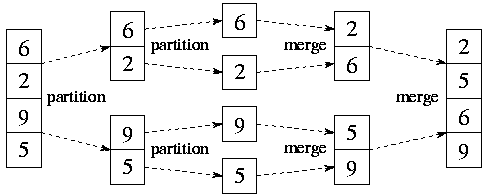

# Sort

## Quick Sort

피봇을 기준으로 나누다보면 전체 리스트가 피봇화되고, 결국에는 정렬할 필요가 없다.


```python
# python code
def quck_sort(a, begin, end):
    if begin < end:
        p = partition(a, begin, end)
        quick_sort(a, begin, p-1)
        quick_sort(a, p, end)

def partition(a, begin, end):
    pivot = (begin + end) // 2
    L = begin
    R = end
    while L < R:
        while(a[L] < a[pivot] and L<R): L += 1
        while(a[R] >= a[pivot] and L<R): R -= 1
        if L < R:
            if L == pivot: pivot = R
            a[L], a[R] = a[R], a[L]
    a[pivot], a[R] = a[R], a[pivot]
    return R
```


## Merge Sort



`여러개의 정렬된 자료의 집합`을 병합하여 한개의 정렬된 집합으로 만드는 방식

그래서 엄밀히 말한다면 `Merge Sort`는 두가지 중 2번으로 볼 수 있다.

1. 자료를 쪼개기 => 분할정복
2. 쪼개진 자료를 두개씩 병합(merge) => 병합 정렬

분할 정복 알고리즘 활용

- 자료를 최소 단위의 문제까지 나눈 후에 차례대로 정렬하여 최종 결과를 얻어낸다.
- top-down 방식

### 시간복잡도 

- O(nlogn)

### Merge Sort 구현

```python
def merge_sort(m):
    if len(m) <= 1:
        return m
    # DIVIDE
    mid = len(m) // 2
    left = m[:mid]
    right = m[mid:]
    # Recusive Call until being list size 1
    left = merge_sort(left)
    right = merge_sort(right)
    # Conquer : merge divided list
    return merge(left, right)

def merge(left, right):
    result = []
    # there are elements in left, right list
    while len(left) > 0 and len(right) > 0:
        # compare two sub list, then add el to result (smaller first)
        if left[0] <= right[0]:
            result.append(left.pop(0))
        else:
            result.append(right.pop(0))
    if len(left) > 0:  # remained at left list
        result.extend(left)
    if len(right) > 0:  # remained at right list
        result.extend(right)
    return result
        

merge_sort([9, 6, 5, 2])
```

```
[2, 5, 6, 9]
```

