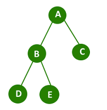

# Tree

한 개 이상의 노드로 이루어진 유한 집합이며 다음 조건을 만족

1. 노드 중 최상위 노드를 루트 노드라 한다.
2. 나머지 노드들은 n개의 분리집합 (T1, T2, ..., Tn)으로 분리될 수 있다.

이들 T1, T2, ..., Tn은 각각 하나의 트리가 되며(`재귀적 정의`) 루트의 부 트리(`sub tree`)라고 한다.

- 비선형 구조
- 원소들 간에 1:N의 관계, 계층 구조를 가지는 자료구조


## 용어

### 노드(node)

트리  T의 노드 (위 그림의 A, B, C, ..., H)

### 간선(edge)

부모 노드와 자식 노드를 연결하는 선

### 루트 노드(root node)

트리의 시작 노드 (위 그림의 A)

### 형제 노드 (sibling node)

같은 부모 노드의 자식 노드들

### 조상 노드

간선을 따라 루트 노드까지 이르는 경로에 있는 모든 노드들

(G의 조상 노드는 F, C, A)

### 서브 트리(sub tree)

부모 노드와 연결된 간선을 끊었을 때 생성되는 트리

### 자손 노드

서브 트리에 있는 하위 레벨의 노드들

### 차수

노드의 차수 : 노드에 연결된 자식 노드 수

트리의 차수 : 트리에 있는 노드의 차수 중에서 가장 큰 값

### 단말 노드(리프 노드)

차수가 0인 노드, 자식 노드가 없는 노드

### 높이

노드의 높이 : 루트에서 노드에 이르는 간선의 수, 노드의 레벨

트리의 높이 : 트리에 있는 노드의 높이 중에서 가장 큰 값, 최대 레벨 ()


## 트리의 종류

|        | 표현                             | 순회              | 종류                                                  |
| ------ | -------------------------------- | ----------------- | ----------------------------------------------------- |
| 트리   | 1차 배열, 링크드리ㅡ스트         | pre/in/post order | 이진/이진탐색/균형이진탐색/힙/허프만/세그먼트 -- 트리 |
| 그래프 | 인접행렬, 인접리스트 (간선 배열) | DFS, BFS          | 다엑스트라, MST, 플로이드, AOE, AOV, 등               |


### 트리의 종류 - binary tree(이진 트리)

모든 노드들이 2개 이하의 서브트리를 갖는 특별한 형태의 트리

- 왼쪽 자식 노드(left child node)
- 오른쪽 자식 노드(right child node)



#### 이진 트리의 특징 (attribute of binary tree)

- 레벨 i에서의 노드의 최대 개수는 2^i개
- 높이가 h인 이진 트리가 가질 수 있는 노드의 최소 개수는 (h+1)개가 되며, 최대 개수는 (2^(h+1) - 1)개가 된다.


#### 이진 트리의 종류

##### 포화 이진 트리 (Full Binary Tree)

- 모든 레벨의 노드가 포화 상태로 차 있는 이진트리
- 높이가 h일 때, 최대 노드 개수인(2^(h+1) - 1)개의 노드를 보유
- 루트를 1번으로 하여 2^(h+1) - 1 까지 정해진 위치에 대한 노드 번호를 가짐

##### 완전 이진 트리 (Complete Binary Tree)

- 높이가 h이고 노드 수가 n개 일 때(h+1 <= n < 2^(h+1) - 1), 포화 이진 트리의 노드 번호 1번 부터 n번 까지 빈 자리가 없는 이진 트리


##### 편향 이진 트리 (Skewed Binary Tree)

높이 h에 대한 최소 개수의 노드를 가지면서 한쪽 방향의 자식 노드만들 가진 이진 트리

노드의 개수 : h - 1

- 왼쪽 편향 이진 트리
- 오른쪽 편향 이진 트리


#### 이진트리 - 순회 (Traversal)

트릐의 각 노드를 중복되지 않게 체계적으로 전부 방문하는 것

##### 순회의 세가지 방법

###### 전위 순회(preorder traversal)

VLR; 부모노드 방문 후 자식 노드를 좌, 우 순서로 방문

###### 수행 방법

1. 현재 노드 n을 방문하여 처리 (V)
2. 현재 노드 n의 왼쪽 서브트리로 이동 (L)
3. 현재 노드 n의 오른쪽 서브트리로 이동 (R)

###### python code

```python
def preorder_traverse(T):
    """전위 순회"""
    if T:
        visit(T)
        preorder_traverse(T.left)
        preorder_traverse(T.right)
```


###### 중위 순회(inorder traversal)

LVR; 왼쪽 자식 노드, 부모 노드, 오른쪽 자식 노드 순으로 방문

###### 수행 방법

1. 현재 노드의 왼쪽 서브트리로 이동 (L)
2. 현재 노드 n을 방문하여 처리(V)
3. 현재 노드 n의 오른쪽 서브트리로 이동 (R)

###### python code

```python
def inorder_traverse(T):
    """중위 순회"""
    if T:
        inorder_traverse(T.left)
        visit(T)
        inorder_traverse(T.right)
```


###### 후위 순회(postorder traversal)

LRV; 자식 노드를 좌우 순서로 방문한 후, 부모 노드로 방문한다.

###### 수행 방법

1. 현재 노드의 왼쪽 서브트리로 이동 (L)
2. 현재 노드의 오른쪽 서브트리로 이동 (R)
3. 현재 노드 n을 방문하여 처리 (V)

###### python code

```python
def postorder_traverse(T):
    """후위 순회"""
    if T:
        inorder_traverse(T.left)
        inorder_traverse(T.right)
        visit(T)
```


#### 이진 트리의 표현

##### 배열을 이용한 이진 트리의 표현


- 이진 트리에 각 노드 번호를 위와 같이 부여
- 루트의 번호를 1로 함
- 레벨 n에 있는 노드에 대하여 왼쪽부터 오른쪽으로 2^n ~ 2^(n+1) - 1 까지 번호를 차례로 부여

##### 노드 번호의 성질

- 노드 번호가 i인 노드의 부모 노드 번호 = i // 2
- 노드 번호가 i인 노드의 왼쪽 자식 노드 번호 = 2 * i
- 노드 번호가 i인 노드의 오른쪽 자식 노드 번호 = 2 * i + 1
- 레벨 n의 시작 노드 번호 = 2^n

##### 배열에서 이진트리 표현

```python
binary_tree = [None for _ in range(2 ** (h + 1) - 1)]
for node in nodes:
    binary_tree[node.index] = node
```

##### 배열을 이용한 이진 트리의 표현의 단점

- 편향 이진 트리와 같이 사용하지 않는 배열 원소에 대한 메모리 공간 낭비
- 트리에 노드를 삽입/삭제 시 배열의 크기 변경이 어렵다.


#### 연결 리스트를 이용한 트리의 표현


- 배열을 이용한 이진트리를 보완할 수 있다.

- 왼쪽/오른쪽 자식 노드의 주소를 가지는 단순 연결 리스트 노드를 사용


> 수식트리
>
> 연산자는 루트 노드이거나 가지 노드
>
> 피연산자는 모두 리프 노드
>
> 중위 순회 => 중위 표기법
>
> 후위 순회 => 후위 표기법
>
> 전위 순회 => 전위 표기법


#### 이진 트리 - 이진탐색트리

- 탐색 작업을 효율적으로 하기 위한 자료구조로 모든 원소는 서로 다른 유일한 키를 가진다.

- 왼쪽 서브 트리 < 루트 노드 < 오른쪽 서브 트리 (각 서브 트리 모두 이진탐색트리)

- 중위 순회하면 오름차순으로 정렬된 값을 얻을 수 있다.

##### 이진탐색트리 - 연산

###### 탐색 연산

1. 루트에서 시작

2. 탐색할 키 값x를 루트 노드의 키 값과 비교
   - (x == root node value) : return root node 

   - (x < root node value) : access left subtree

   - (x > root node value) : access right subtree

3. 서브트리에 대해서 재귀적으로 탐색 연산을 반복한다.

###### 삽입 연산

1. 탐색 연산 수행
   - 삽입할 원소와 같은 값이 있다면 에러
2. 탐색 실패한 위치에 원소 삽입

##### 이진탐색트리 - 연산 속도(성능)

탐색(searching), 삽입(insertion), 삭제(deletion) = {

​	"일반적인 경우": O(h),

​	"이진 트리가 균형적으로 생성되어있는 경우": O(log n),

​	"최악의 경우(한쪽으로 치우친 경사 이진 트리 등)": O(n),

}

#### 이진 트리 - 검색 알고리즘의 비교

- 배열에서의 순차 검색 : O(N)
- 정렬된 배열에서의 순차 검색 : O(N)
- 정렬된 배열에서의 이진 탐색 : O(log N)
- 이진 탐색 트리에서의 평균 : O(log N)
- 이진 탐색 트리에서의 최악 : O(N)
- 해쉬 검색 : O(1) -- 추가 저장 공간 필요

### 이진 트리 - 힙(heap)

완전 이진트리에 있는 노드 중에서 키 값이 가장 큰 노드나 키 값이 가장 작은 노드를 찾기 위해서 만든 자료구조

- 최대 힙(max heap)
  - 가장 큰 노드를 찾기 위한 `완전 이진 트리`
  - 부모 노드의 키값 > 자식 노드의 키값
  - 루트 노드 : 키값이 가장 큰 노드
- 최소 힙(min heap)

  - 키값이 가장 작은 노드를 찾기 위한 `완전 이진 트리`

  - 부모 노드의 키값 < 자식 노드의 키값
  - 루트 노드 : 키값이 가장 작은 노드

### 연산

#### 삽입

1. 자리 확보
2. 부모 노드와 크기비교 후 부모 노드보다 크면 자리 바꿈(최대힙)
3. 부모노드보다 작거나 루트노드와 바꿀때 까지 자리를 바꾼다.

#### 삭제 (루트노드)

1. 루트노드와 마지막 노드 swap
2. 마지막 노드 삭제
3. 루트노드와 자식노드 중 큰 노드 swap -- 반복

