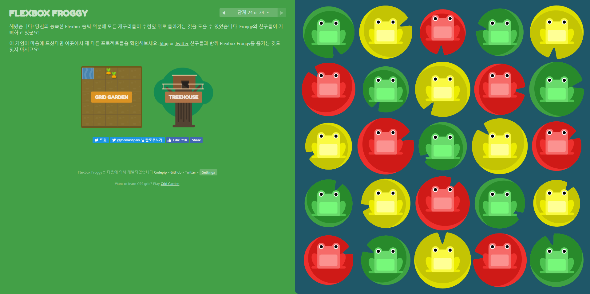

# [flexboxfroggy](https://flexboxfroggy.com/#ko)

## 수평 정렬

### 오른쪽 정렬

```html
#pond {
	display: flex;
	justify-content: flex-end;
}
```

### 왼쪽 정렬

```html
#pond {
	display: flex;
	justify-content: flex-start;
}
```

### 가운데 정렬

```html
#pond {
	display: flex;
	justify-content: center;
}
```

### 수평 방향 적절한 배치

```html
#pond {
	display: flex;
	justify-content: space-around;
}
```

### 양끝을 기준으로한 수평방향 배치

```html
#pond {
	display: flex;
	justify-content: space-between;
}
```

> `display: flex;` 를 이용하여 태그를 flexbox로 만들고
>
> `justify-content`와 `flex-start`, `center`, `space-around`등을 이용하여 수평 정렬을 시켜준다.


## 수직 정렬

수평 정렬과 같이 `display: flex;`를 이용하여 flexbox로 만들어주고난 뒤에

`justify-content` 대신에 `align-items`를 이용해서 수직 정렬을 시킬 수 있다.

```html
align-items: flex-start;
align-items: flex-end;
align-items: center;
align-items: space-between;
align-items: space-around;
```


## 방향 재지정

```css
flex-direction: row; /* 행방향 */
flex-direction: row-reverse; /* 행방향 역순 */
flex-direction: column; /* 열방향 */
flex-direction: column-reverse; /* 열방향 역순 */
```

### 

> flex-direction을 이용하여 역순으로 방향을 재지정한 경우,
>
> justify-content로 정렬할 때도 역방향으로 정렬된다.


### flex 요소의 순서 지정하기

```css
order: <integer>; /* -1, 0, 1, 2, ...*/
```


>  음의 정수는 -1이건 -2이건 가장 왼쪽으로 보낸다.


> order와 align-self등 정렬과 같이 사용하면 순서에 관계없이 order이 먼저 적용된다.


### flex요소들 줄 나눔 정하기

```css
flex-wrap: nowrap; /* 한줄에 우겨넣기 */
flex-wrap: wrap; /* 여러줄에 걸쳐서 정렬 */
flex-wrap: wrap; /* 여러줄에 걸쳐서 반대로 정렬 */
```


### flex-direction + flex-wrap = flex-flow

```css
flex-flow: <flex-directoin의 인자> <flex-wrap의 인자>;
```


### flex-wrap이나 flex-flow로 나눈 줄 간격 조정하기

```css
align-content: flex-start;
align-content: flex-end;
align-content: center;
align-content: space-between;
align-content: space-around;
align-content: stretch; /* 여러 줄을 컨테이너에 맞도록 늘리기 */
```


## flexfrog ending

