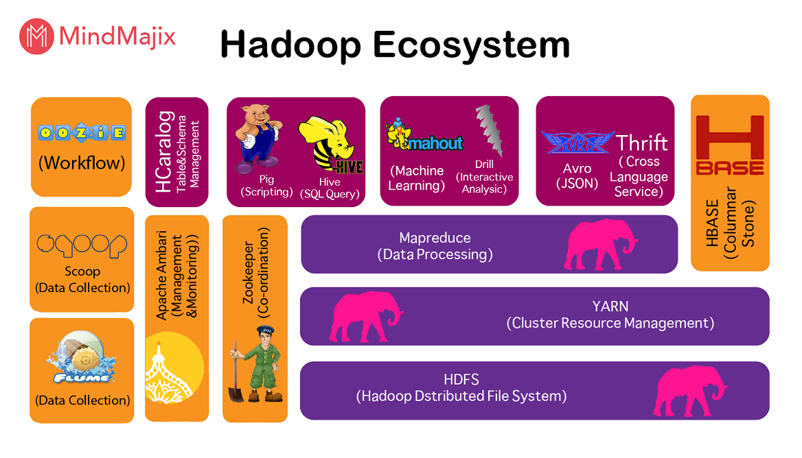

## Hadoop

### 빅데이터의 개념

- 빅데이터는 기존 DB의 역량을 넘어서는 데이터로 하둡에서는 분산처리 시스템을 이용해 DW를 만들어서 한계점을 보완하려고 합니다.

- 빅데이터의 3요소 (3V)

  1. 크기 (Volume)
  2. 속도 (Velocity)
  3. 다양성 (Variety)

- 빅데이터의 4요소 (4V)

     (+) 가치 (Value)

- 빅데이터의 5요소 (5V)

     (+) 정확성 (Vaeracity)

- 데이터의 종류
  - 정형 데이터
  - 반정형 데이터
  - 비정형 데이터
  - 스키마의 유무, 연산이 가능한지에 따라 분류된다.

### 하둡 (Hadoop)

**아파치 하둡**(Apache Hadoop, High-Availability Distributed Object-Oriented Platform)은 대량의 자료를 처리할 수 있는 큰 컴퓨터 클러스터에서 동작하는 분산 응용 프로그램을 지원하는 [프리웨어](https://ko.wikipedia.org/wiki/프리웨어) [자바](https://ko.wikipedia.org/wiki/자바_(프로그래밍_언어)) [소프트웨어 프레임워크](https://ko.wikipedia.org/wiki/소프트웨어_프레임워크)이다.  (위키피디아)

- 하둡 분산 파일 시스템(HDFS: Hadoop Distributed File System)과 맵리듀스를 구현한 것이다. 

### 하둡 에코시스템 (Hadoop Eco System)

- 하둡이 각 비즈니스에 맞게 서브프로젝트로서 제공되는 형태

- 핵심 : HDFS, MapReduce, YARN

#### Zookepper (분산 코디네이터; Co-ordination)

- 역할
  1. 서비스가 하나의 서버에 집중되지 않도록 `요청 분산`

  2. 한 서버에서 처리한 결과를 전체 서버들에 `동기화`
  3. 운영 서버에 문제가 생긴 경우 서브 서버를 `메인 서버로 관리`
  4. 전체 서버의 `통합 환경 설정 관리`

#### YARN

- 클러스터 자원(CPU, 메모리) 및 스케줄링 등 `자원 관리`를 하기 위한 프레임워크
- 맵리듀스의 단점을 극복하기 위한 서비스
- Hadoop 2.0부터 적용

#### HBASE

- column 기반의 분산 데이터베이스

#### KUDU

- HDFS 기반으로 처리가 가능한 column 기반 스토리지