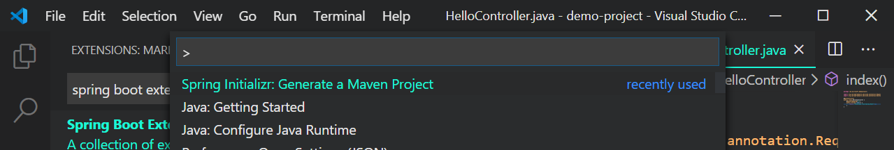
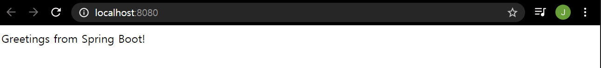

# Start Spring Boot

[ref](<https://code.visualstudio.com/docs/java/java-spring-boot>)

## Install

### 1. jdk 1.8

#### 설치

- [jdk 1.8 설치](<https://www.oracle.com/java/technologies/javase-jdk8-downloads.html>)


### 2. visual studio code

#### 설치

- [vs code 설치](https://code.visualstudio.com/download)


#### 설치할 확장팩(Extension)

vs code 내에서 `ctrl + shift + x`로 Extensions에 이동하여 아래 확장팩을 설치

- [java extension pack](<https://github.com/Microsoft/vscode-java-pack>)
- [Spring Boot Tools](https://marketplace.visualstudio.com/items?itemName=Pivotal.vscode-spring-boot)
- [Spring Initializr](https://marketplace.visualstudio.com/items?itemName=vscjava.vscode-spring-initializr)
- [Spring Boot Dashboard](https://marketplace.visualstudio.com/items?itemName=vscjava.vscode-spring-boot-dashboard)


### 3. Maven

프로젝트 구조의 패턴으로 생산성과 이해에 좋은 프로그램, 구체적으로 아래에 도움이 된다.

- Builds
- Documentation
- Reporting
- Dependencies
- SCMs
- Releases
- Distribution


#### 설치

1. [maven 3.6.3 다운로드](<https://maven.apache.org/download.cgi>) (Binary zip archive - Link 설치)

2. 적절한 곳에 압축 풀기

3. 환경변수 설정

   - 시스템 속성 - 환경변수 - 시스템변수 - MAVEN_HOME = `maven 폴더 경로` 설정

   - 시스템변수 Path에 `%MAVEN_HOME%\bin` 추가 

4. cmd에서 mvn --version으로 잘 설치와 환경변수 설정이 잘 되었는지 확인


## 시작하기

### Maven 프로젝트 생성



`ctrl + shift + p`를 눌러서 `Spring Initializr: Generate a Maven Project`로 프로젝트 생성기 실행

이 이후로 아래 항목을 입력/선택하여 프로젝트를 생성한다.

- project language

  Java, Kotlin, Groovy 중 선택

- Group Id

  com으로 시작하는 src내에 프로젝트 파일 관리를 위한 경로 설정인데, 타 프로젝트에서는 src/WEB-INF/com으로 많이 시작하지만 여기서는 대문자를 허용하지 않기 때문에 com.til와 같이 아무렇게나 쓰고 이따가 바꿔도 좋다.

- Artipact Id

  프로젝트명

- Spring version

- Dependency

  Web(높은 버전에서는 Spring Web), Spring Boot DevTools 두가지 선택

  이후 원하는 의존성을 택한다.

  여기서 선택한 Dependency는 root dir의 pom.xml에 설정되는데, 지금 설정한 것과 동일한 방식으로 수정이 가능하다. (pom.xml 파일이나 파일 내에서 `우클릭 - edit starters`)

- 프로젝트 생성 위치 설정

  선택한 폴더 내에 `Artipact Id`로 프로젝트가 생성된다.


### 프로젝트 실행

#### 생성된 프로젝트

```
├─.mvn
│  └─wrapper
├─.settings
├─src
│  ├─main
│  │  ├─java
│  │  │  └─com
│  │  │      └─microsoft
│  │  │          └─demo
│  │  └─resources
│  │      ├─static
│  │      └─templates
│  └─test
│      └─java
│          └─com
│              └─microsoft
│                  └─demo
├─target
│   ├─classes
│   │  └─com
│   │      └─microsoft
│   │          └─demo
│   └─test-classes
│       └─com
│           └─microsoft
│               └─demo
├─.classpath
├─.gitignore
├─.project
├─HELP.md
├─mvnw
├─mvnw.cmd
└─pom.xml
```

위와 같이 생성되는데 사실상 볼 것은 `src`와 `pom.xml` 두가지다.

src에 MVC패턴의 Controller 부분을 작성하고

pom.xml에서 방금 설정한 의존성(Dependency) 설정을 한다.


#### Controller 작성

```java
//src.main.java.com.til.HelloProject.java
package com.microsoft.demoproject;

import org.springframework.web.bind.annotation.RequestMapping;
import org.springframework.web.bind.annotation.RestController;

@RestController
public class HelloController {
    @RequestMapping("/")
    public String index() {
        return "Greetings from Spring Boot!";
    }
}
```

`src.main.java.com.til` 위치에 `HelloProject.java` 파일을 위 내용으로 작성한다.

`@RestController`로 HelloController 클래스가 Restful한 형태로 사용할 것을 알려주는 것 같다.

`@RequestMapping`으로 User가 내 서버의 주소로 그중에서도 주소로만 호출을 할 때(/는 아무것도 안붙이는 것과 같음) 해당 index 함수를 호출하여 `Greetings from Spring Boot!`를 반환한다.


#### 진짜 실행

간단하게 f5를 누르고 싶지만 설정이 잘못되어있는 경우 아무 일도 없거나 일반 java debugger가 작동할 수 있다.

이때 아까 설치해둔 SPRING-BOOT DASHBOARD 확장팩을 사용한다.

Explorer 모드 (Ctrl+Shift+E)에서 왼쪽 최하단에서 찾을 수 있고, 리스트를 보면 내 프로젝트명이 보인다.




`우클릭 - Start`로 실행한 후 `우클릭 - Open In Browser`을 클릭하면

위와 같이 localhost:8080이라는 주소로 요청이 일어났고

내 스프링 서버는 인사로 반겨준다.