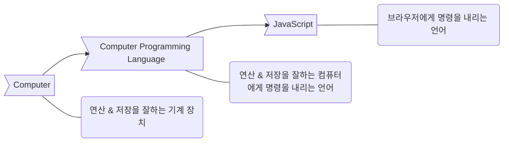

# JavaScript

## Web의 연대기 & JavaScript는 공식 문서가 없다???

js를 만든 사람이 현재 활동중X

넷스케이프 Navigator (브라우저)에서 브라우저를 조작할 수 있도록 만든 언어로 나온 `JavaScript`

그러다가 OS를 독점한 MS가 표준을 지키지 않는 IE를 무료 배포함으로써 브라우저의 암흑기가 시작된다.

IE, Netscape의 정신을 이어받은 Mozila의 Firefox 등등에 의해 각자의 표준을 정하고 각각의 JavaScript를 가지게 된다.

이렇게 표준이 여러가지로 나뉘게 됨으로써 웹의 발전이 느려지게 된다.

그러다 표준을 잘 지키는 크롬이 점유율을 올려가면서 표준화 시대가 열리게 된다.

`ECMA 인터네셔널`에서 `JavaScript` 표준화의 가장 큰 줄기라고 할 수 있다.

## Computer Programming Language

Computer : 연산 & 저장을 잘하는 기계 장치

Computer Programming Language : 연산 & 저장을 잘하는 컴퓨터에게 명령을 내리는 언어

JavaScript : 브라우저에게 명령을 내리는 언어

## 여러개의 프로그래밍 언어 배우기

### 저장

1. 무엇
   - Data Type
2. 어디에
   - 변수
   - 딕셔너리
3. 어떻게

### 조작

- 조건
- 반복

## JS의 대표적인 문서

[MDN Web Docs](<https://developer.mozilla.org/ko/>)

## JavaScript Extensions in VS Code

1. Live Server

2. JavaScript (ES6) code snippets

3. Bracket Pair Colorizer

