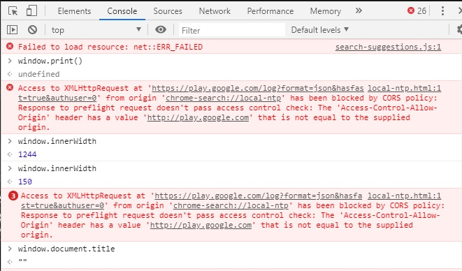

# JS 사용하는 법

## 1. in browser (chrome)

`ctrl + shift + j`를 이용하여 console을 띄울 수 있다.




## 2. in html

`html`의 `script` 태그 안에서 js 코드가 돌아간다.

```html
<script>
    alert("이제 JS 공부 시작")
    console.log("이제 JS 공부 시작")
</script>
```

