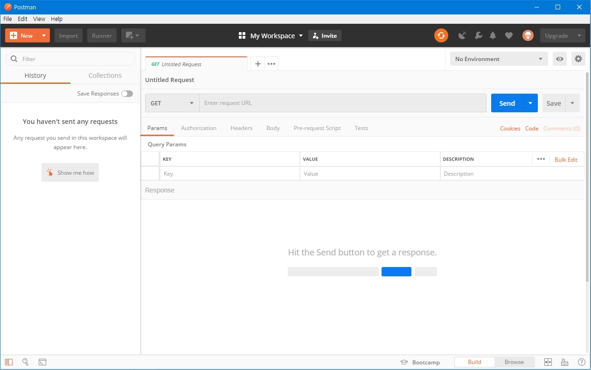
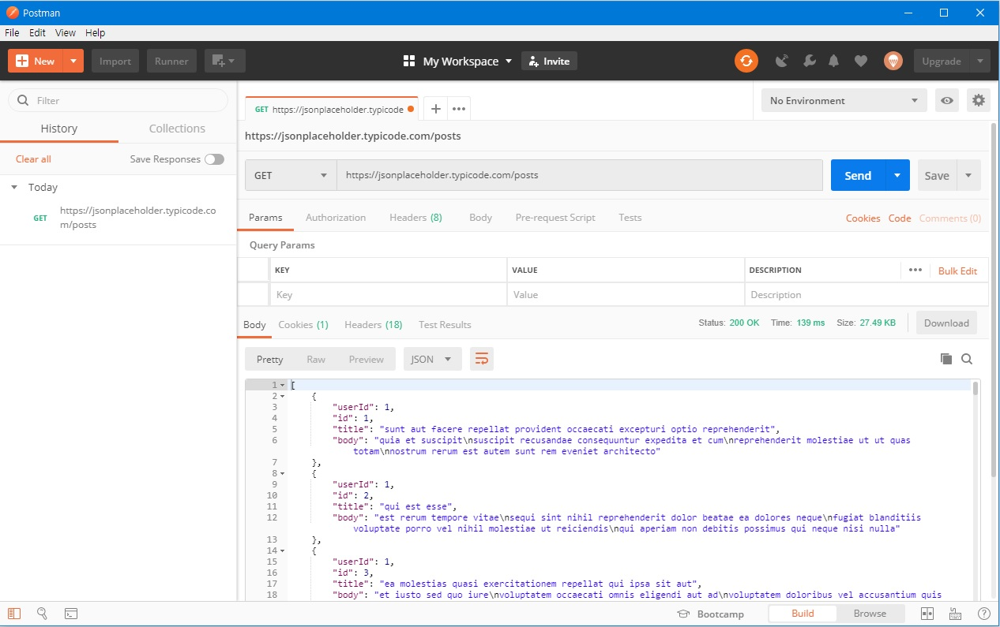
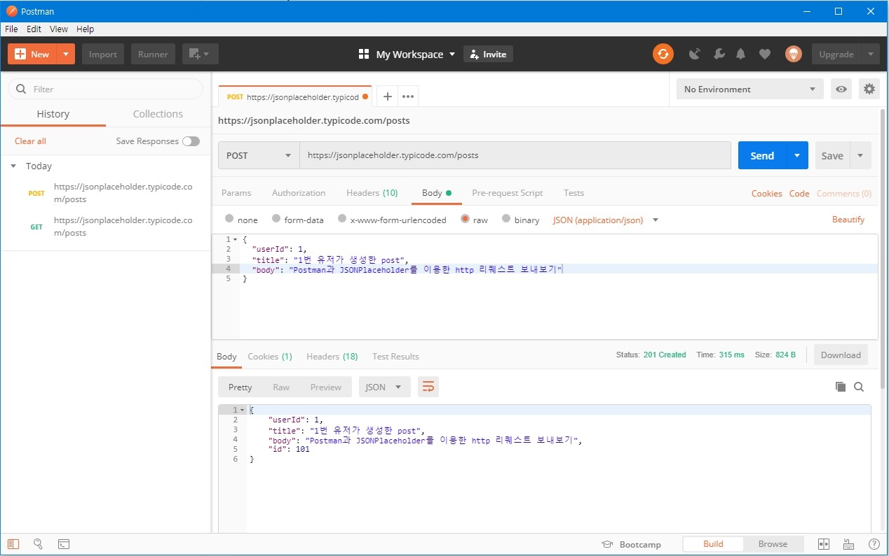
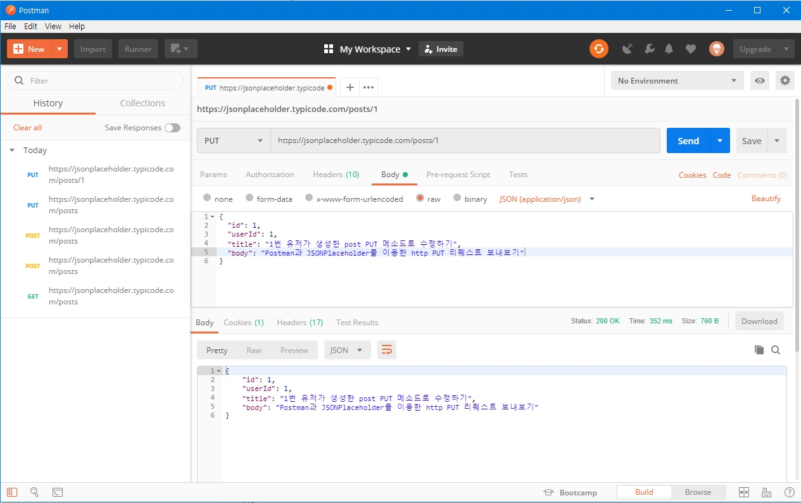
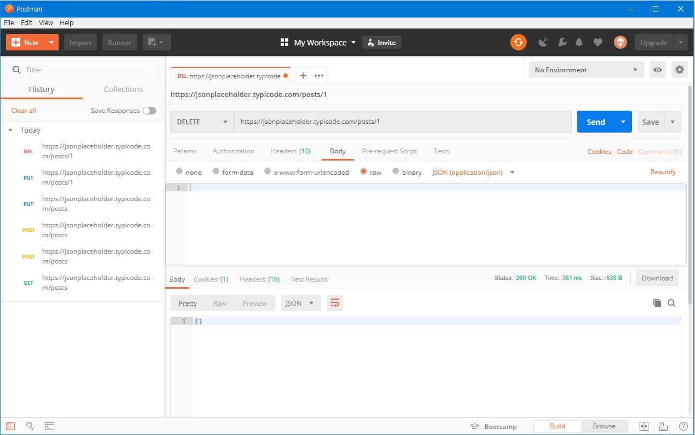

# HTTP Protocol & REST API

## HTTP

### 초기

링크달린 문서를 교환하는 방식

### 기본 속성

`Stateless` : 상태정보가 저장되지 않음, 클라이언트가 서버와 상호작용을 하기 위해서 HTTPS `쿠키`를 만들고, 상태가 있는 세션을 활용할 수 있도록 보완

`Connectless` : 서버에 요청을 하고 응답을 한 이후에 연결은 끊어짐


### URL

```
http://localhost:3000/posts/3?q=http#continers
http : 
localhost : 
3000 : 
/posts/3 : 
q=http : 
continers : 
```


> resource == data


### HTTP Request(요청) 메세지

| 구분        | 비고                                                         |
| ----------- | ------------------------------------------------------------ |
| 요청 메세지 | /post/3                                                      |
| 헤더        | User-Agent: Mozila/5.0 (Macintosh;...).. Firefox/51.0...     |
| 본문        | POST등 요청의 경우 본문의 내용이 포함될 수 있으며, 일반적으로 HTML 폼과 연계되어 사용됨 |


### HTTP 메서드

기존의 특정한 형식이 없던 HTTP 메서드를 정리한 형태로, 결국, `REST API`로 정리되었다.

| 구분      | 비고                                                   |
| --------- | ------------------------------------------------------ |
| GET       | 지정 리소스의 표시를 요청하며, 오직 데이터를 받기만 함 |
| POST      | 클라이언트 데이터를 서버로 보냄.                       |
| PUT/PATCH | 서버로 보낸 데이터를 저장/지정 리소스의 부분만을 수정  |
| DELETE    | 지정 리소스를 삭제                                     |

<br>

## REST API

URL에 동사를 남기지 않겠다!


### REST 중심 규칙

1. URI는 정보의 자원을 표현해야 한다.
2. 자원에 대한 행위는 HTTP Method로 표현한다.


### 기존 URL에 REST 적용

| 기존                 | REST               |
| -------------------- | ------------------ |
| GET /users/1/show    | GET /users/1       |
| GET /users/1/delete  | DELETE /users/1    |
| POST /users/create   | POST /users        |
| POST /users/1/update | PUT/PATCH /users/1 |


### RESTful URI 작성 팁

- `/`는 계층 관계를 나타내는데 사용
- 마지막에는 `/`를 포함하지 않음
- URI에는 소문자를 사용
- 파일 확장자는 포함시키지 않음
- 밑줄 대신에 `-` 활용


> [rest api uri tests](https://jsonplaceholder.typicode.com/)


## HTTP 전송 파일 형식의 변천사

XML => YAML => JSON

- XML : key를 열어놓고 또 닫아야해서 번거롭다.
- YAML : 여전히 조금 번거롭다.
- JSON : 언어별로 비슷한 데이터 형식으로 key-value pair 형식이 있어서 호환성이 좋다.


## REST API 실습 (JSONPlaceholder/Postman & Javascript)

[install postman](<https://www.getpostman.com/downloads/>)

[JSONplaceholder Homepage](<https://jsonplaceholder.typicode.com/>)

[How to JSONplaceholder](<https://github.com/typicode/jsonplaceholder#how-to>)




postman 어플리케이션을 설치, 로그인 후 처음 페이지입니다.


### GET method

- Poastman



- javascript

```js
// axios (javascript version of python requests)

const URL = 'https://jsonplaceholder.typicode.com/'
const XHR = new XMLHttpRequest()

// 요청 준비하기
// XHR.open(<어떤 HTTP Method를 쓸지>, <URL>)
XHR.open('GET', URL + 'posts')

// 요청 보내기 send
XHR.send()

// 예외사항등을 이벤트 리스너로 처리하기
XHR.addEventListener('load', function(e){
    // e.target.response : response가 저장되어있는 위치
    const result = e.target.response
    console.log(result)

    const jsObject = JSON.parse(result)
    console.log(jsObject)

    const jsString = JSON.stringify(jsObject)
    console.log(jsString)
})
```


### POST Method

- Postman



- javascript

```js
const URL = 'https://jsonplaceholder.typicode.com/'
const XHR = new XMLHttpRequest()

XHR.open('POST', URL+'posts')
XHR.setRequestHeader('Content-Type', 'application/json;charset=UTF-8')

// 요청 보내기 send (data 전송)
// XHR.send(json)
// XHR.send(JSON.stringify(object))
let data = {
    userId: 1,
    title: '타이틀',
    body: '내용'
}
XHR.send(JSON.stringify(data))

XHR.addEventListener('load', e => {
    const result = e.target.response
    const jsObject = JSON.parse(result)
    console.log(jsObject)
    // {userId: 1, title: "타이틀", body: "내용", id: 101}
})
```


### PUT

- Postman



- javascript

```js
const URL = 'https://jsonplaceholder.typicode.com/'
const XHR = new XMLHttpRequest()

XHR.open('PUT', URL+'posts/1')
XHR.setRequestHeader('Content-Type', 'application/json;charset=UTF-8')

let data = {
    id: 1,
    userId: 1,
    title: '타이틀',
    body: '내용'
}
XHR.send(JSON.stringify(data))

XHR.addEventListener('load', e => {
    const result = e.target.response
    const jsObject = JSON.parse(result)
    console.log(jsObject)
    // {id: 1, userId: 1, title: "타이틀", body: "내용"}
})
```


### DELETE

- Postman



- javascript

```js
const URL = 'https://jsonplaceholder.typicode.com/'
const XHR = new XMLHttpRequest()

XHR.open('DELETE', URL+'posts/1')
XHR.setRequestHeader('Content-Type', 'application/json;charset=UTF-8')
XHR.send()

XHR.addEventListener('load', e => {
    const result = e.target.response
    const jsObject = JSON.parse(result)
    console.log(jsObject)
    // {id: 1, userId: 1, title: "타이틀", body: "내용"}
})
```


