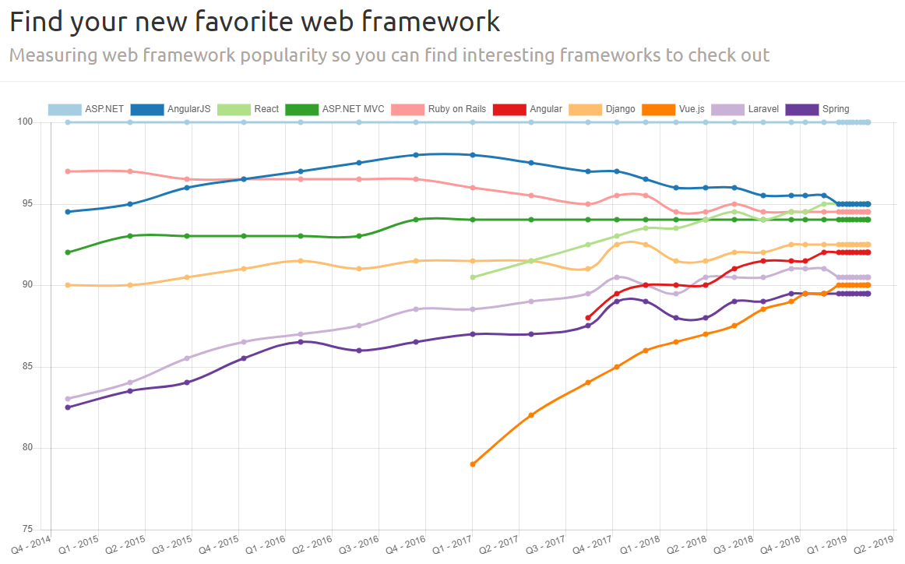
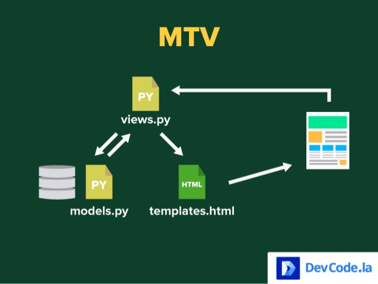
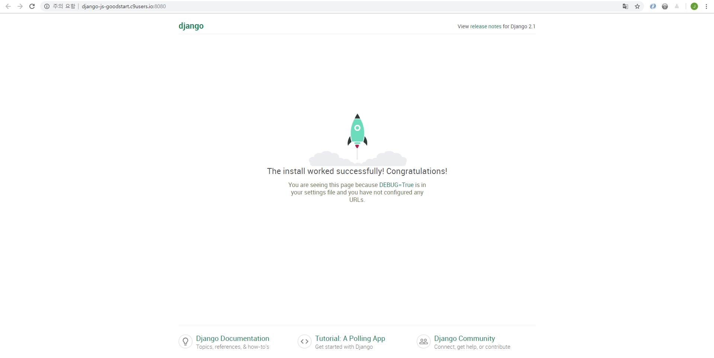
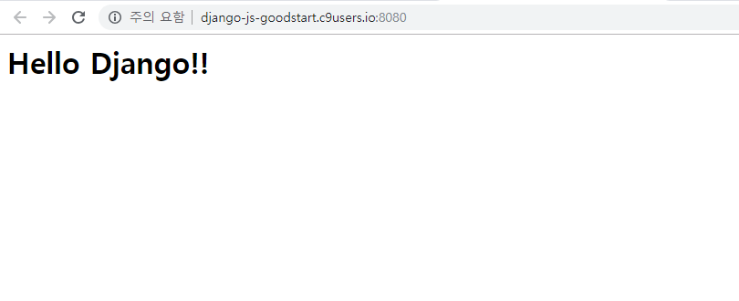
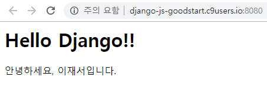

# Django Web Framework

## 웹서비스를 제작하는 장고 파이썬 프레임워크

장고는 카페 창업시 프랜차이즈를 이용하는 것과 같다.

개인 카페 창업시에는 에스프레소기, 원두 등 카페에 들어가는 모든 것을 창업자가 직접 알아보고 구매를 해야하지만 프랜차이즈는 모든 것을 준비해둔 것과 같이

장고에서는 웹서비스를 구축하는데 필요한 작업들을 미리 준비해두었다.




## Django 구조




Model : 데이터 관리

Template : 사용자가 보는 화면

View : 중간 관리자


## 장고 시작하기

```
OS : Ubuntu 14.04.5 LTS on c9
Python : Python 3.4.3
pyenv : 3.6.7
```

[c9](https://aws.amazon.com/ko/cloud9/)

### 가상 환경 설정

#### pyenv 설치하기

pyenv를 통해서 서버, 프로젝트마다, 다른 버전의 파이썬 버전을 관리할 수 있다.

```bash
git clone https://github.com/pyenv/pyenv.git ~/.pyenv
echo 'export PYENV_ROOT="$HOME/.pyenv"' >> ~/.bashrc
echo 'export PATH="$PYENV_ROOT/bin:$PATH"' >> ~/.bashrc
echo -e 'if command -v pyenv 1>/dev/null 2>&1; then\n  eval "$(pyenv init -)"\nfi' >> ~/.bashrc
exec "$SHELL"

git clone https://github.com/pyenv/pyenv-virtualenv.git $(pyenv root)/plugins/pyenv-virtualenv
echo 'eval "$(pyenv virtualenv-init -)"' >> ~/.bashrc
exec "$SHELL"
```

exec "$SHELL"은 변경사항을 적용시키기 위해서 터미널을 재시작시킨다.

```bash
pyenv install 3.6.7
```

python 자체를 새롭게 설치하는 만큼 5분 정도 오래 걸렸다.

```bash
pyenv global 3.6.7
```

python 가상환경 시작

```bash
mkdir PRACTICE
cd PRACTICE
```

`PRACTICE`라는 이름의 프로젝트 경로 생성

```bash
pyenv virtualenv 3.6.7 practice-venv
pyenv local practice-venv
```

```bash
(practice-venv) goodstart:~/workspace/PRACTICE $
```

`practice-venv`라는 이름으로 `python 3.6.7버전`의 가상환경을 생성

이 프로젝트 내부에서는 `practice-venv`환경을 사용하고 위 처럼 디렉토리 왼쪽에 현재 적용된 가상환경이 나타난다.


비교를 해보기 위해서 PRACTICE 경로와 상위 경로에서 `pip list` 명령어를 실행해보면 다음과 같이 가상환경내부에서만 `django`가 설치된 것을 확인할 수 있다.

```bash
Package    Version
---------- -------
Django     2.1.7  
pip        10.0.1 
pytz       2018.9 
setuptools 39.0.1 
```

```
Package    Version
---------- -------
pip        10.0.1 
setuptools 39.0.1 
```


### django project 생성

```bash
django-admin startproject practice .
```

현재 경로를 practice 장고 프로젝트로 생성한다.

```bash
tree
```

```python
.
├── manage.py
└── practice
    ├── __init__.py # 건들일 없음
    ├── settings.py # 장고 프로젝트 설정
    ├── urls.py # 라우팅
    └── wsgi.py # 서비스 배포시 필요
```

#### 장고 서버 테스트 실행시켜보기

```python
# practice/settings.py
ALLOWED_HOSTS = [
    "django-js-goodstart.c9users.io",
]
```

접속할 ip를 `settings.py`에 등록시켜 주고

```bash
python manage.py runserver 0.0.0.0:8080
```

서버 테스트 실행



장고 프로젝트를 만들어 처음 실행시 이 화면이 나온다.

> python manage.py runserver 명령어는 장고 웹서버를 만들때 테스트를 위한 목적이므로 실제 서비스 운용시에는 apache24나 nginx 같은 웹서버를 사용해야한다.


### 장고 프로젝트 설정

#### 장고 시간대(timezone) 변경

장고는 기본적으로 협정 세계시(UTC)로 한국 시간과 9시간 차이로 한국 시간은 UTC+9를 사용한다.

이를 적용시켜주기위해서 `settings.py`에서 다음과 같이 바꿔준다.

```python
# practice/settings.py
TIME_ZONE = 'Asia/Seoul'
```

```
February 13, 2019 - 13:05:52
Django version 2.1.7, using settings 'practice.settings'
Starting development server at http://0.0.0.0:8080/
```


#### 장고 언어(language) 변경

```python
# practice/settings.py
LANGUAGE_CODE = 'ko-kr'
```


<strike>`ko-kp`는 북쪽나라이므로 주의</strike>


#### 앱 생성

```bash
python manage.py startapp pages
```

`pages`라는 장고 내부에서 사용하는 앱을 생성합니다.

> 앱이란 장고 프로젝트의 콘텐츠가 실행되도록 하는 역할

```
.
├── db.sqlite3
├── manage.py
├── pages
│   ├── __init__.py
│   ├── admin.py
│   ├── apps.py
│   ├── migrations
│   ├── models.py
│   ├── tests.py
│   └── views.py
└── practice
    ├── __init__.py
    ├── settings.py
    ├── urls.py
    └── wsgi.py
```

위에서 설명한 MTV 중 M(models.py)과 V(views.py)가 pages 앱 내부에 생성되었습니다.

그리고 `settings.py`에 앱을 등록해줍니다.

```python
# settings.py
INSTALLED_APPS = [
    'pages',
    ...
]
```

admin, auth 등은 장고 프로젝트에서 할 수 있는 기능들이므로 사용하지 않는다면 지워도 무방하다.


> `INSTALLED_APPS` 리스트의 마지막에 따라오는 ","는 trailing comma로 개발자의 편의를 위해서 comma를 붙여서 끝낸다.


### index.html을 홈페이지로 사용해보기

```python
# flask exmple
@app.route("/")
def index():
    return render_template("index.html")
```

flask에서는 @app.route("/")에서 라우팅받아서 render_template에서 index.html으로 연결시켜준다.

이것을 장고에서는 

```python
from django.contrib import admin
from django.urls import path
from pages import views

urlpatterns = [
    path('admin/', admin.site.urls),
    path('', views.index)
]

```

`@app.route("/")`역할으로 `path(url, 연결한 views의 함수)`으로 사용

```python
# pages/views.py
from django.shortcuts import render

def index(request):
    return render(request, "index.html")
```

여기서 `index.html`로 접근

```html
<!-- pages/templates/index.html -->
<h1>Hello Django!!</h1>
```





플라스크에서 사용했던 Jinja2와 비슷하게 DTL(Django Template Language)을 사용할 수 있다.


```python
# pages/views.py
from django.shortcuts import render

def index(request):
    context = {
        "msg": "안녕하세요",
        "name": "이재서",
    }
    return render(request, "index.html", context)
```

여기서 `index.html`로 접근

```html
<!-- pages/templates/index.html -->
<h1>Hello Django!!</h1>
{{ msg }}, {{ name }}입니다.
```

html에 적용



적용된 결과

