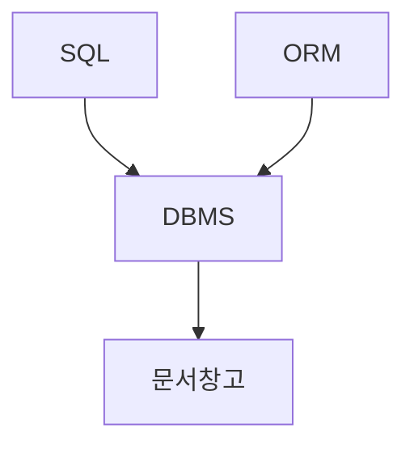

# ORM in Django



문서를 관리하기 위해 DBMS를 사용하고, DBMS에서 데이터 관리를 위해 SQL을 사용합니다.

Database마다 조금씩 다른 SQL들을 최적화하기 위해서 ORM을 사용하여 DBMS를 조작할 수 있습니다.

또한 ORM은 사용자가 비효율적인 코드를 작성하더라도 `lazy loading`을 통해서 최적화를 시킨 후에 코드를 작동시킵니다.


## Table Info

```python
class Article(models.Model):
    title = models.TextField()
    content = models.TextField()
    
    def __repr__(self):
        return f"제목: {self.title}, 내용: {self.content}"
    
    def __str__(self):
        return f"제목: {self.title}, 내용: {self.content}"
```


## Python Console in Django Config

```bash
$ ls
articles/  db.sqlite3  manage.py*  pracdb/
$ python manage.py shell
Python 3.6.7 (default, Feb 13 2019, 02:16:34) 
[GCC 4.8.4] on linux
Type "help", "copyright", "credits" or "license" for more information.
(InteractiveConsole)
>>> Here you can test django orm!
```


## ORM

### Load Article model (table)

```python
from articles.models import Article
```

### Create

```python
Article(title="hello", content="this is JAESEOLEE").save()
a = Article(title="hello", content="this is JAESEO")
a.save()
```

```
No Return Value or Text
```

### Read

```python
my_article = Article.objects.get(title="hello", content="this is JAESEO")
print(my_article)
```

```
제목: hello, 내용: this is JAESEO
```

```python
my_articles = Article.objects.filter(title="hello")
print(my_article)
```


### Update

```python
my_article = Article.objects.filter(title="hello").first()
my_article.title = "hi"
my_article.save()
```


### Delete

```python
my_article = Article.objects.filter(title="hi")
my_article.delete()
```


## Queryset API

### Q

Field Lookup Function


### exact

### iexact

### contains

### icontains

### 

### 

### 

### 