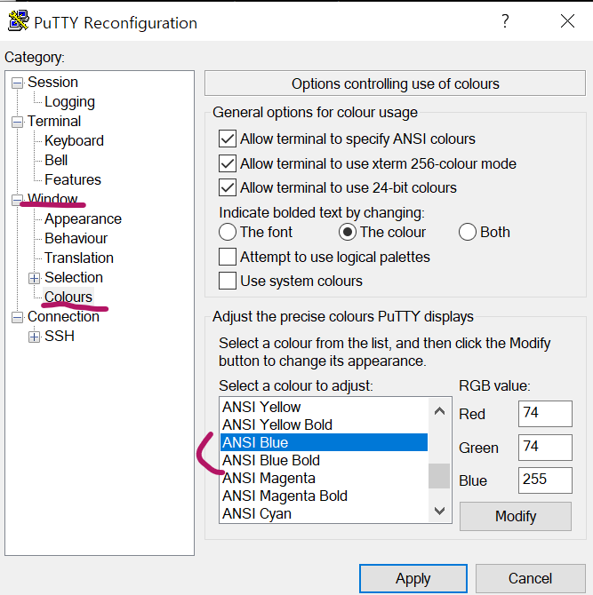

# 푸티(PuTTY) 환경설정

## PuTTY 글씨가 안보여요!

[특히 파랑색이 잘 안보인다. 세팅하는 법을 친절하고 자세히 올려준 블로그가 있어서 정리..](<https://freeprog.tistory.com/132>)

ANSI Blue : 74/74/255

ANSI Blue Bold : 140/140/255

각각 오른쪽 하단의 R/G/B에 적용하면 된다.
