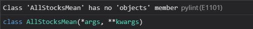

# Trouble Shooting in VS Code

## pylint

### E1101



Class 'AllStocksMean' has no 'objects' member pylint(E1101) occured when creating a Django project in VS code.

Class 'AllStocksMean' is model of Django Database.

#### E1101 - Solution

1.  install pylint-django

you may already install pylint immediately after downloading vs code but pylint-django isn't

```
pip install pylint-django
```

2. set pylint-django setting

open upper input form by entering `ctrl + shift + p`

and select `>Preferences: Open Settings (JSON)`

When User Settings file is opened, copy below code to Settings file

```json
{
    "python.linting.pylintArgs": ["--load-plugins=pylint_django"],
}
```