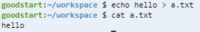
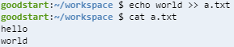
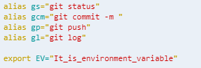
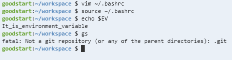
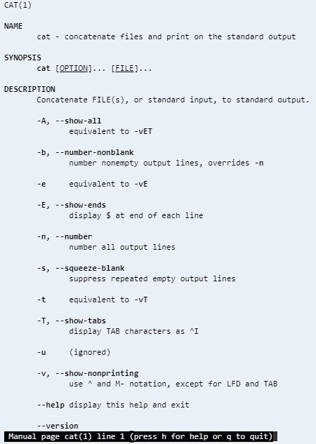

# CLI Command

Command of Command Line Interface

## write output to your file

### write output log to your own file

```
$ echo 'hello' > a.txt
```



If you run this command, then a.txt is rewritten.

### append output log to your text file

```
$ echo 'world' >> a.txt
```



## environment variable





## man (manual)

★★★★★

```
$ man <function you want to know>
```





## directory

mkdir

touch

rm

rmdir

tree

mv

cp