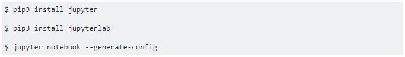
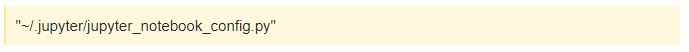

# Stackoverflow Question

For the first time, I asked Stackoverflow for a Jupyter Trouble Shooting.

Stackoverflow's grammar is differ from markdown slightly

## Question 

### code block

Stackoverflow use not ``` ``` but `tab`




### show file directory

use `>`




